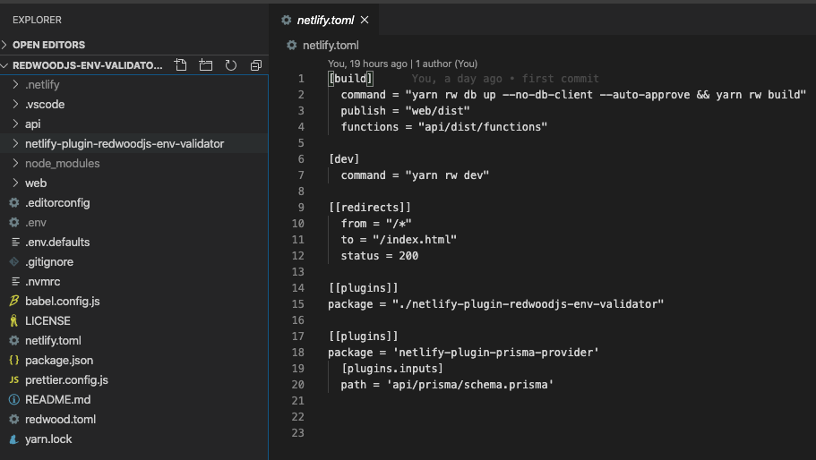
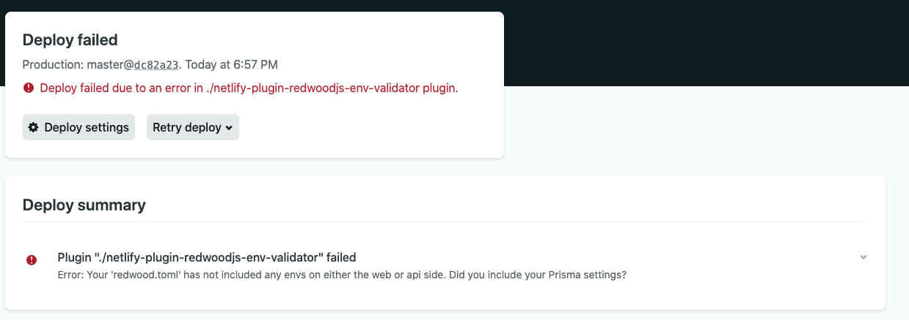
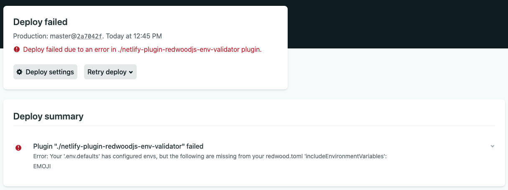
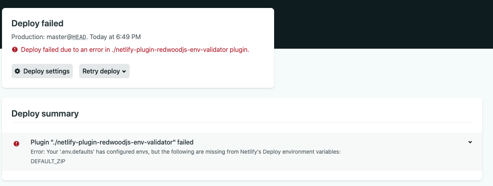

#  netlify-plugin-redwoodjs-env-validator

This [Netlify Build Plugin](https://docs.netlify.com/configure-builds/build-plugins/) helps to validate [RedwoodJS](https://redwoodjs.com/) [environment variables](https://redwoodjs.com/docs/environment-variables) when [deploying](https://docs.netlify.com/site-deploys/overview/) to [Netlify](https://www.netlify.com/).

It aims to check that the environment variables needed for a healthy running RedwoodJS app have been properly setup; and it helps to keep them in sync betwen the `.env.defaults` to `redwood.toml` and the deployment environment configuration.

## Why?

When deploying a RedwoodJS app to Netlify, even though you have setup the Build environment variables as part of teh Netlify Build & deploy settings, there is still [one step needed](https://redwoodjs.com/docs/environment-variables#web) to make those envs available on the `web` side of your RewoodJS app, either:

1. Prefix your env vars with `REDWOOD_ENV_`
1. Whitelist them in your `redwood.toml`
1. Define them in your `.env` file.

See: [https://redwoodjs.com/docs/environment-variables#web](https://redwoodjs.com/docs/environment-variables#web)

Since prefixing with `REDWOOD_ENV_` could make for long envs and re0names them (in a way) and you definitely will and should not check your `.env` to with the settings to the Github repo, then best option is to "Whitelist them in your `redwood.toml`.

That requires that you need to keep everything in sync and up-to-date which means that you may have added a new env, but forgotten to whitelist it; or you removed an env and it is still whitelisted, or you whitelisted and env and forgot to add it to Netlify, and so on.

The first time deploying a RedwoodJS app to Netlify, I didn't know to whitelist envs and my app broke all over the place.

This build plugin is here to help!

## Setup

RedwoodJS uses [dotenv-defaults](https://github.com/mrsteele/dotenv-defaults) which allows you to keep a safe to commit file of the environmetn variable, but with defauilt or non-sensitive (or mock/blank) settings.

```
# .env.defaults, safe to commit
HOST=website.com
EMAIL=
```

```
# .env, DO NOT COMMIT
HOST=omnionline.us
EMAIL=test@email.com
```

Those defaults will be overwritten with settings from the build environment when deploying.

In your RedwoodJS app, your `.env.defaults` might define your database and some secret authentication settings ...

```
# .env.defaults, safe to commit

DATABASE_URL=

AUTH0_DOMAIN=""
AUTH0_CLIENT_ID=""
AUTH0_AUDIENCE=""
AUTH0_REDIRECT_URI=""
```

... that you'd define in your `.env` but not commit.

```
# .env, DO NOT COMMIT
DATABASE_URL="postgres://user@localhost:5432/database?connection_limit=1"

AUTH0_DOMAIN="a-real.domain"
AUTH0_CLIENT_ID="a-real-client-id"
AUTH0_AUDIENCE="http://example.com"
AUTH0_REDIRECT_URI="http://example.com"
```

As a best practivce (and for this plugin to work properly), you need to define ***every** env neeeded for your app in `.env.defaults`.

This also helps developers know exactly which envs and settigns are needed to fully run and deploy the app.

Then you'll ensure that the envs gets included via your [`redwood.toml`](https://redwoodjs.com/docs/app-configuration-redwood-toml):

```
[web]
  port = 8910
  apiProxyPath = "/.netlify/functions"
  includeEnvironmentVariables = ['AUTH0_AUDIENCE','AUTH0_REDIRECT_URI','AUTH0_DOMAIN','AUTH0_CLIENT_ID']
[api]
  port = 8911
  includeEnvironmentVariables = ['DATABASE_URL','BINARY_TARGET']
[browser]
  open = true
```

Note: Defining the `api` side isn't needed to run the app, but helps to keep all in sync for the purposes of this plugin.

Now that the plugin knows the "expected env" as defined in `env.defaults` it can check that:

* Deploy env isn't missing any
* redwood.toml has included all of them
* redwood.toml hasn't included any ones no longer needed

See the Scenarios below.

### Troubleshooting

You **must** use `""` when defining an **empty default**.

Otherwise you may see an error when building on Netlify like:

```
bash: -c: line 0: unexpected EOF while looking for matching `"'
bash: -c: line 1: syntax error: unexpected end of file
````
Alternatively, just specify mock values like:

```
# .env.defaults, safe to commit

DATABASE_URL="url"

AUTH0_DOMAIN="domain"
AUTH0_CLIENT_ID="id"
AUTH0_AUDIENCE="url"
AUTH0_REDIRECT_URI="url"
```


## Usage

Add a ``[[plugins]]`` entry to your `netlify.toml` file.

Note since this package is not published, you'll have to use [File based installation](https://docs.netlify.com/configure-builds/build-plugins/#file-based-installation) and copy the contents of this repo to the root of your RedwoodJS app project.

```
[[plugins]]
package = './netlify-plugin-redwoodjs-env-validator'
```

Until this plugin is packaged, you'll have to include the plugin code alongside your app in file-based installation mode.



You may also have to add `netlify-plugin-redwoodjs-env-validator` as a package in your app's `package.json` and `yarn install`.

```
{
  "private": true,
  "workspaces": {
    "packages": [
      "api",
      "web",
      "netlify-plugin-redwoodjs-env-validator"
    ]
  },
  ```

## Local Use

You can [run builds in Netlify CLI](https://docs.netlify.com/cli/get-started/#run-builds-locally) to mimic the behavior of running a build on Netlify — including Build Plugins.


### Run Netlify builds locally

You will ned to install the [Netlify CLI](https://docs.netlify.com/cli/get-started/#installation).

```
# Install Netlify CLI globally
npm install netlify-cli -g

### OR use Yarn ### 
yarn global add netlify-cli
```

To execute a Netlify build locally, run the following command from the root of your project:

```
netlify build
```

If you'd like to get a summary of what a build will do without taking the time to do a full build, you can use the --dry flag:

```
netlify build --dry
```

For sample build output, see Scenarios.

## Scenarios

### Success!!!

```
6:47:42 PM: ┌─────────────────────────────────────────────────────────────────────┐
6:47:42 PM: │ 1. onPreBuild command from ./netlify-plugin-redwoodjs-env-validator │
6:47:42 PM: └─────────────────────────────────────────────────────────────────────┘
6:47:42 PM: ​
6:47:42 PM: Validating the environment configuration for RedwoodJS deployment to Netlify ...
6:47:42 PM: Expecting Netlify Environment settings to set envs defined in your RedwoodJS '.env.defaults'.
6:47:42 PM: DATABASE_URL
6:47:42 PM: BINARY_TARGET
6:47:42 PM: OPEN_WEATHER_MAP_TOKEN
6:47:42 PM: EMOJI
6:47:42 PM: DEFAULT_ZIP
6:47:42 PM: ... ok!
```

### No includeEnvironmentVariables set in redwood.toml

If the `includeEnvironmentVariables` in`redwood.toml` is empty,
that's strange because probably have at least set the
`DATABASE_URL` or `BINARY_TARGET` required by Prisma

#### Example



```
6:57:55 PM: ┌──────────────────────────────────────────────────────────┐
6:57:55 PM: │ Plugin "./netlify-plugin-redwoodjs-env-validator" failed │
6:57:55 PM: └──────────────────────────────────────────────────────────┘
6:57:55 PM: ​
6:57:55 PM:   Error message
6:57:55 PM:   Error: Your 'redwood.toml' has not included any envs on either the web or api side. Did you include your Prisma settings?
```

### Missing includeEnvironmentVariables set in redwood.toml

There are expected envs, but some of them are not found in the `redwood.toml`

#### Example



```
7:00:01 PM: ┌──────────────────────────────────────────────────────────┐
7:00:01 PM: │ Plugin "./netlify-plugin-redwoodjs-env-validator" failed │
7:00:01 PM: └──────────────────────────────────────────────────────────┘
7:00:01 PM: ​
7:00:01 PM:   Error message
7:00:01 PM:   Error: Your '.env.defaults' has configured envs, but the following are missing from your redwood.toml 'includeEnvironmentVariables':
7:00:01 PM: ​
7:00:01 PM:   EMOJI
```

### Missing in Netlify's configured env

There are expected envs, but some of them are not found in Netlify's configured env

Note: this actually checks the env's configured on Netlify. So, even if the exist in you .env, you still need to set them up in Netlify.

#### Example



```
6:49:58 PM: ┌─────────────────────────────────────────────────────ß─────┐
6:49:58 PM: │ Plugin "./netlify-plugin-redwoodjs-env-validator" failed │
6:49:58 PM: └──────────────────────────────────────────────────────────┘
6:49:58 PM: ​
6:49:58 PM:   Error message
6:49:58 PM:   Error: Your '.env.defaults' has configured envs, but the following are missing from Netlify's Deploy environment variables:
​
6:49:58 PM:   DEFAULT_ZIP
```

### Missing includeEnvironmentVariables in Netlify's configured env

There are envs defined in `redwood.toml`, but some of them are not found 
in Netlify's configured env.

This might mean there is an env that is no longer neeed -- or maybe a typo?

#### Example


```
7:06:42 PM: ┌──────────────────────────────────────────────────────────┐
7:06:42 PM: │ Plugin "./netlify-plugin-redwoodjs-env-validator" failed │
7:06:42 PM: └──────────────────────────────────────────────────────────┘
7:06:42 PM: ​
7:06:42 PM:   Error message
7:06:42 PM:   Error: Your 'redwood.toml' has included envs, but the following are missing from Netlify's Deploy environment variables:
​
7:06:42 PM:   NO_LONGER_NEEDED_ENV
```

## Demo 

The sample [redwoodjs-env-validator-playground](https://github.com/dthyresson/redwoodjs-env-validator-playground) RedwoodJS app demostrates use of this plugin.

A [demo](https://redwoodjs-env-validator-playground.netlify.app) is available at [https://redwoodjs-env-validator-playground.netlify.app](https://redwoodjs-env-validator-playground.netlify.app).

## Issues

https://github.com/dthyresson/netlify-plugin-redwoodjs-env-validator/issues

## Considerations

* Lacks tests
* Have not checked how well this plays with Netlify's [Sensitive variable policy](https://docs.netlify.com/configure-builds/environment-variables/#sensitive-variable-policy)
* Currently, the Plugin code has to be included alongside deployed app
* Maybe not log out the expected? Concern if logs are public and they expose keys?

## Future

* Package up 
* Update the toml with the necessary expected envs?
